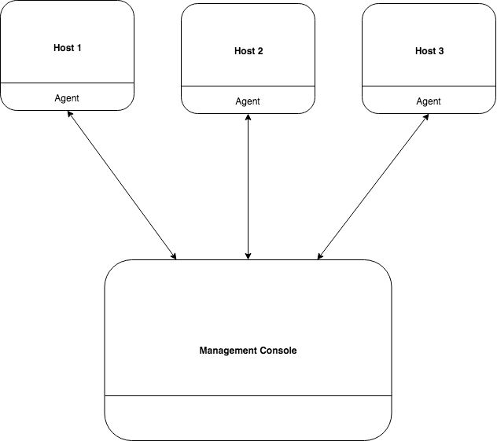

# UMUC Group Project
This project will be completed as part of the CMSC 495 - Current Trends and Projects in Computer Science course.

# Service Beacon
Service Beacon is a server software that is install as an agent to track upgrade and perform patch status of the host's running programs. 
Using a management console web application the administrator is able to view all server host that have a Service Beacon agent installed and can view all running programs on each hosts with upgrade and patch status.

